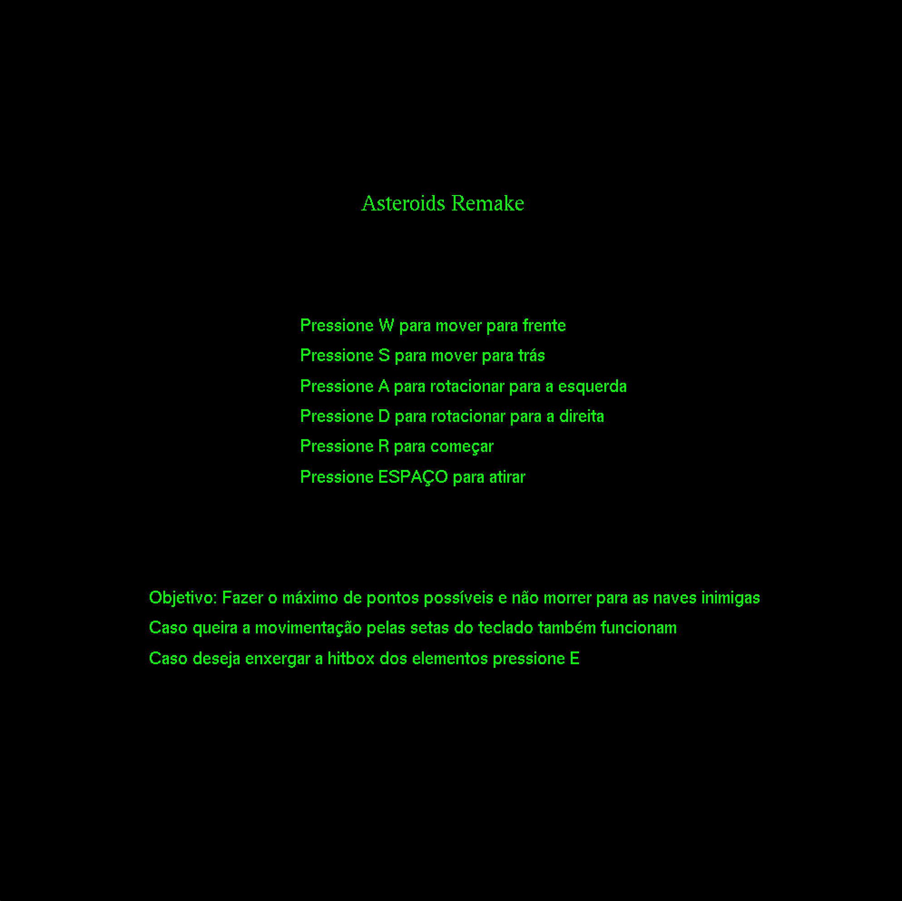
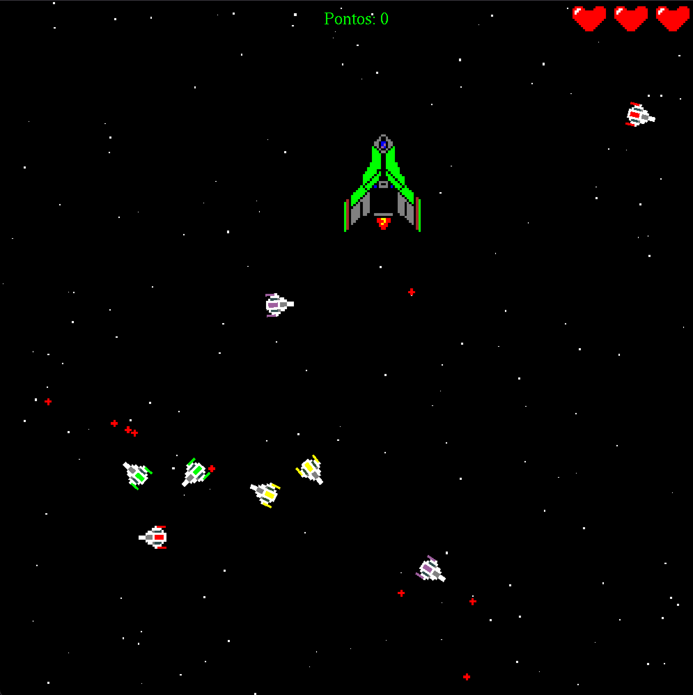
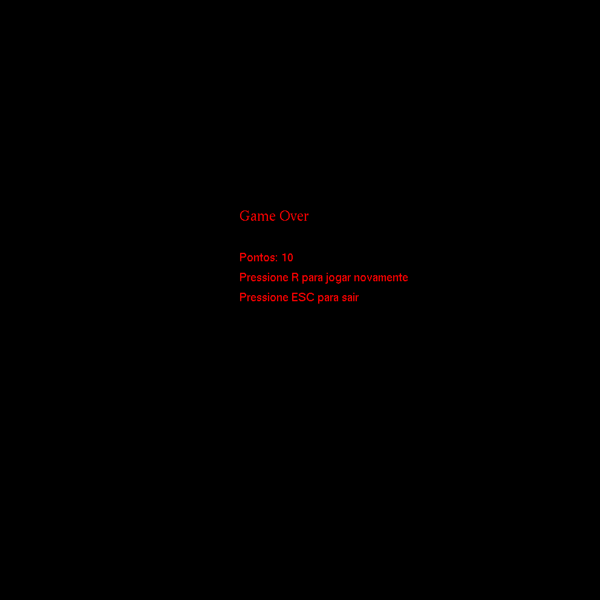

# Trabalho 1 da disciplina de Computação Gráfica PUCRS

Jogo Asteroids desenvolvido em Python com OpenGL

## Autor :bust_in_silhouette:

Desenvolvido por [Bernardo Zamin](https://github.com/Bernardo-Zamin)
